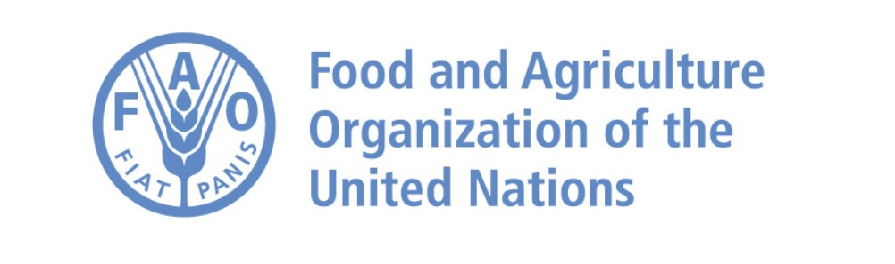

# Réalisez une étude de santé publique avec Python

## Contexte et objectifs

  
La FAO (Food and Agriculture Organization of the United Nations) est l’un des organes qui composent l’ONU et dont l’objectif est "d’aider à construire un monde libéré de la faim".  

Récemment embauchée au sein d'une équipe de chercheurs de la FAO en tant que Data Analyst, la mission consiste à réaliser une étude de grande ampleur sur le thème de l’alimentation et plus particulièrement sur la sous-nutrition dans le monde.

## Soft Skills
- Réaliser une exploration de données de A à Z  
- Capacité à s'approprier des outils et à les utiliser  
- Structuration logique des analyses pour faciliter la compréhension par d'autres interlocuteurs  
- Documenter efficacement du code et les résultats d'analyses.

## Compétences
- Explorer et analyser les données en utilisant le langage de programmation Python  
- Découverte des librairies Python pour la data science (NumPy, Matplotlib, Pandas, Seaborn...)  
- Prise en mains d'outils métiers (Jupyter Notebook)

## Outils utilisés
Notebook Jupyter

## 
>Attention ! : Ce projet a été réalisé dans le cadre de la formation "Data Analyst" avec l'organisme OpenClassrooms.
>

## Visuels du projet
  
  
  
  
  
